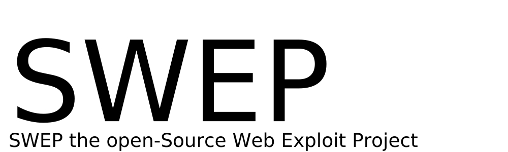

# SWEP
  

 
SWEP is an open-source Web Exploitation Project.
## Version
Ver 1.0.2 intruder development
## Description
This is SWEP Intruder development branch for automatic penetration testing. 
This is NOT a stable version. Use as your own risk. 
Welcome join our development. Contact us with mail above. 
## Todo
Intruder framework: 
New spider for intruder 
New SQL injection scanner for intruder 
New FTP Bruteforcing tool for intruder 
Logical vulnability scanner for intruder 
## Usage
WARNING: This is a development branch 
## Disclaimer
###### SWEP and BREACHER security comes with ABSOLUTATLY NO RESPONSIBILITY 
Don't use it to do illegal things. Although we don't really care if you did. 
And we have no reponsibility if you do that, so take care. 
### Contact us
Wanna join us? 
Contact us at <intercepter@gmail.com>. 

BREACHER security
